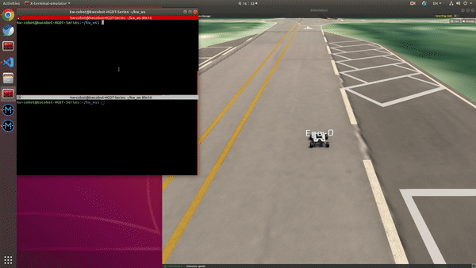
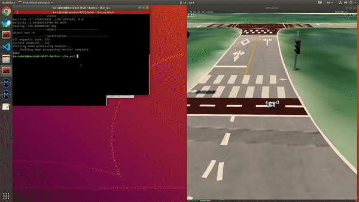

# Scout-mini GPS Simulation

## 목표
- Morai_Simulation 내부의 GPS을 이용해서 Mapping & Navigation

---

1. Mapping 
    - 모라이 시뮬레이션 시작, GPS 사용이기에 실내보다는 실외 맵으로 실행
    - 로봇에 GPS 장착 후 connect
    - 아래 launch 파일 실행
    ```
    roslaunch rosbridge_server rosbrigde_websocket.launch
    roslaunch scout_ros path_maker.launch

    ```
    - 실행 하면 **[xx.xxxx, xx.xxxx]** 이렇게 나오면 맵이 저장되고 있다는 것
    - 0.5m씩 이동할때마다 좌표값이 출력되고 로봇을 이동시켜 Path를 만든다.
    - 다 만들고 path_maker.launch 종료하면 scout_ros 패키지의 path 폴더에 xxx.txt 파일이 생성

-------

2. Path Planning and Following
    - Mapping에서 path_maker 런치 파일만 끈 상태에서 시작
    - 로봇에 IMU를 설치 한후 Connect
    
    ```
    roslaunch scout_ros planner.launch
    ```

    - 실행 하면 **(예)** [False,True,True,False] 등 상태가 나온다.
    - GPS, IMU Connect/ Disconnect 한번씩 눌러서 False -> True로 바뀌는 지 확인
    - F4 눌러서 로봇의 Pulblish, Subscirbe 쪽 Connect 버튼 한번씩 눌러주기
    - 실행 화면에서 모두 [True, True, True, True]가 되면 어떤 값이 나옴
    - 켜진 Rviz 화면에서 형성된 Path 확인
    - Morai에서 AutoMode로 변경하면 Path를 따라서 로봇이 이동

-----

3. Parameter 및 launch 파일 설명
    #### Launch
    - 1. path_maker.launch
         - node pkg = 어느 노드 패키지에 속하는지,
         - type = 실행 파일 설정
         - name = 노드 이름
         - args = 함수 값 (map이 저장될 폴더, 저장할 이름, 위도, 경도)
         - output = 출력 위치

    - 2. planner.launch
        - args = map이 저장된 파일, 시작 위도, 시작 경도
        - rviz 실행 및 설정 노드
              - args = rviz 설정 파일 위치

    #### ParaMeter(utils.py의 함수)
    - 1. Pure pursuit
      주어진 path를 따라가게 하기 위한 알고리즘
           1. vehicle length
           1. lfd = look forward distance
           1. min_lfd : 최소 lfd
           1. max_lfd : 최대 lfd
           1. steering : 조향각(이 변수를 이용해서 로봇의 회전 속도를 결정)
     
    - 2. local planning and lattice
         경로 최적화 및 장애물 회피를 위한 예비 경로 계산 및 표시
            1. lane_off_set - 예비 경로의 간격
            2. lane_weight - 경로 선택시 어느것을 먼저 선택할지에 대한 가중치(가운데부터 멀어질 수록 가중치가 높음)
   
    - 3. pidController
      시뮬레이션의 모터 속도 제어
            1. p_gain    
            2. i_gain
            3. d_gain
            4. controlTime - 제어기 dt
            5. prev_error
            6. i_control

--------
   
4. 영상

    
    
    ---
   
    
